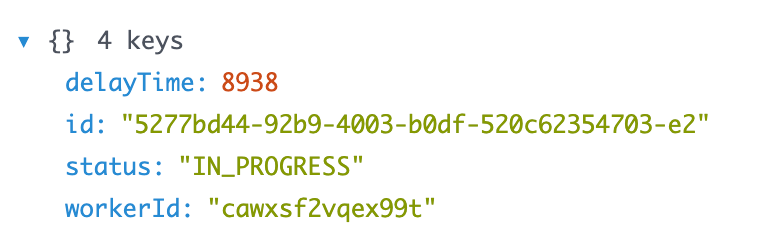
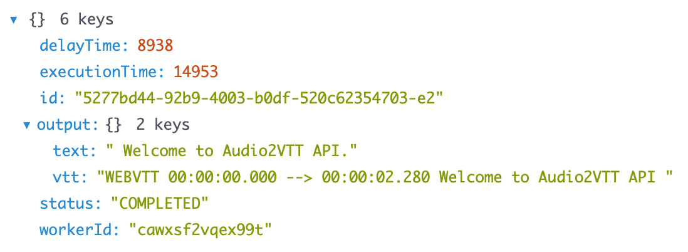

# Audio to VTT API

Convert audio files to VTT subtitles using Faster-Whisper. Supports FastAPI server and RunPod serverless deployment.

[](https://console.runpod.io/hub/garylab/audio2vtt)

## Features

- 🎵 Multiple audio formats (MP3, WAV, M4A, FLAC, OGG, AAC)
- 🚀 Fast transcription with Faster-Whisper
- 📝 VTT (WebVTT) format output with timestamps
- 🔧 Configurable models and settings
- 🐳 Docker support (CPU/GPU)
- ☁️ RunPod serverless deployment ready
- 🔐 Optional API key authentication


## Snapshots




## Quick Start

### Docker (Recommended)

```bash
# CPU version
docker-compose up

# GPU version
docker-compose -f docker-compose-gpu.yml up
```

### Local Installation

```bash
pip install -r pyproject.toml
python src/main.py
```

Server runs on `http://localhost:8000`. Visit `/docs` for interactive API documentation.

## API Usage

### FastAPI Endpoints

**POST** `/vtt` - Transcribe audio file
```bash
curl -X POST "http://localhost:8000/vtt" \
  -H "X-API-Key: your-key" \
  -F "file=@audio.mp3" \
  -F "language=en"
```

### RunPod Serverless

**Input:**
```bash
curl -X POST "http://localhost:8000/vtt" \
-H "Content-Type: application/json" \
-d '{
  "input": {
    "audio": "<base64_encoded_audio>",
    "filename": "audio.mp3",
    "language": "en"
  }
}'
```

**Output:**
```json
{
  "vtt": "WEBVTT\n\n00:00:00.000 --> ...",
  "text": "Plain text transcription"
}
```

## Configuration

Key environment variables:

| Variable | Default | Description |
|----------|---------|-------------|
| `WHISPER_MODEL` | `base` | Model size: tiny, base, small, medium, large, large-v3 |
| `WHISPER_DEVICE` | `cpu` | Device: cpu, cuda, metal |
| `WHISPER_COMPUTE_TYPE` | `int8` | Compute type: int8, float16, float32 |
| `WHISPER_BEAM_SIZE` | `5` | Beam size for decoding |
| `API_ADMIN_KEY` | `` | API key (leave empty to disable auth) |

See `.env` file for all options.

## Supported Languages

Auto-detects language or specify: `en`, `es`, `fr`, `de`, `it`, `pt`, `ru`, `ja`, `ko`, `zh`, etc.

## Output Format

```
WEBVTT

00:00:00.000 --> 00:00:03.500
Hello, this is a test transcription.
```

## License

MIT License - see [LICENSE](LICENSE) file for details.
